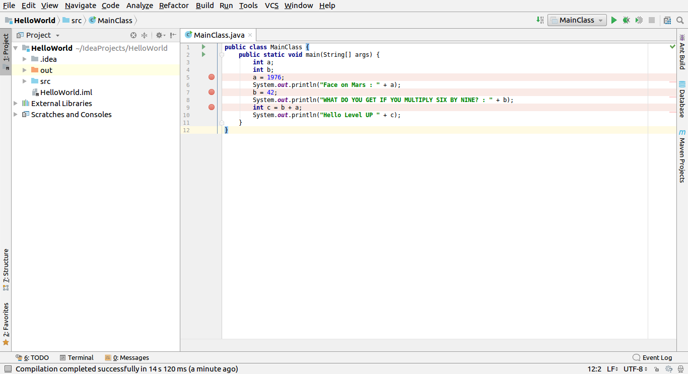
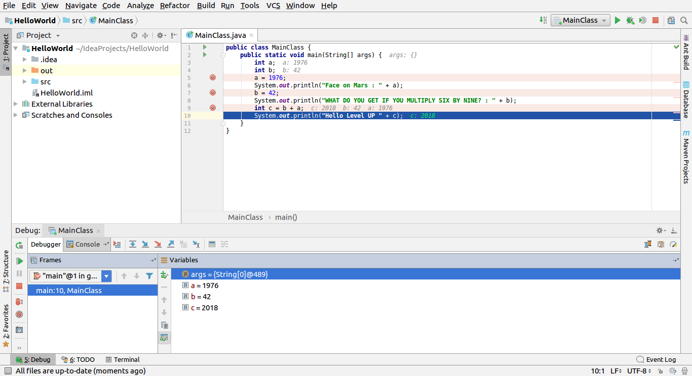

# Занятие 1. Введение.

1. [Введение](#introduction)
    1. [Что такое машинный код?](#machine_code)
    2. [Что такое язык программирования?](#programm_language)
    3. [Компилируемые, интерпретируемые и встраиваемые языки](#comp_int)
    4. [Статическая и динамическая типизация](#typing)
2. [Java](#java)
    1. [История создания языка Java](#java_history)
    2. [Основные особенности языка](#features)
    3. [JVM](#jvm)
    4. [Рейтинги](#IEEE)
    5. [Использование Java](#java_use)
    6. [Инструменты, которые понадобятся](#ide)
3. [Hello Word!](#hello)
    1. [Структура программы](#structure)
    2. [Синтаксис языка](#syntax)
    3. [Создание первого проектах](#first_project)
4. [Отладка](#debug)

<a name="introduction"/>

## Введение

<a name="machine_code"/>

### Что такое машинный код?

**Машинный код** — система команд (набор кодов операций) конкретной вычислительной машины, которая интерпретируется непосредственно процессором или микропрограммами этой вычислительной машины.

Компьютерная программа, записанная на машинном языке, состоит из машинных инструкций, каждая из которых представлена в машинном коде в виде так называемого **опкода** — двоичного кода отдельной операции из системы команд машины. Для удобства программирования вместо числовых опкодов, которые только и понимает процессор, обычно используют их условные буквенные обозначения. Набор таких обозначений называется **языком ассемблера**.

<a name="programm_language"/>

### Что такое язык программирования?
Язык программирования — формальный язык, предназначенный для записи компьютерных программ. Язык программирования определяет набор лексических, синтаксических и семантических правил, определяющих внешний вид программы и действия, которые выполнит исполнитель (обычно — ЭВМ) под её управлением.

<a name="comp_int"/>

### Компилируемые, интерпретируемые и встраиваемые языки
Можно выделить три принципиально разных способа реализации языков программирования: **компиляция**, **интерпретация** и **встраивание**. Распространено заблуждение, согласно которому способ реализации является присущим конкретному языку свойством. В действительности, это деление до определённой степени условно.

**Компиляция** означает, что исходный код программы сперва преобразуется в целевой (машинный) код специальной программой, называемой **компилятором** — в результате получается исполнимый модуль, который уже может быть запущен на исполнение как отдельная программа.

**Интерпретация** означает, что исходный код выполняется непосредственно, команда за командой — так что программа просто не может быть запущена без наличия интерпретатора.

**Встраивание языка** — язык является синтаксическим и семантическим подмножеством некоего другого языка, без которого он не существует.

<a name="typing"/>

### Статическая и динамическая типизация
**Система типов** — совокупность правил в языках программирования, назначающих свойства, именуемые типами, различным конструкциям, составляющим программу — таким как переменные, выражения, функции.

 **Статическая типизация** определяется тем, что конечные типы переменных и функций устанавливаются на этапе компиляции. Т.е. уже компилятор на 100% уверен, какой тип где находится. В **динамической типизации** все типы выясняются уже во время выполнения программы.

<a name="java"/>

## Java

<a name="java_history"/>

### История создания языка Java
Создатели языка инженеры компании Sun Microsystems:

Патрик Ноутон (Patrick Naughton) - руководитель группы инженеров.

Джеймс Гослинг (James Gosling) - член Совета директоров и, как его еще иногда называют, разносторонний "компьютерный волшебник".

История создания языка Java начинается в июне 1991 года, изначально язык назывался Oak («Дуб»), разрабатывался для программирования бытовых электронных устройств. Впоследствии он был переименован в Java и стал использоваться для написания клиентских приложений и серверного программного обеспечения. Назван в честь марки кофе Java, которая, в свою очередь, получила наименование одноимённого острова (Ява), поэтому на официальной эмблеме языка изображена чашка с горячим кофе. Существует и другая версия происхождения названия языка, связанная с аллюзией на кофе-машину как пример бытового устройства, для программирования которого изначально язык создавался.

Но официальной датой создания языка Java считается **23 мая 1995 года**, после выпуска компанией Sun первой реализации **Java 1.0**. Она гарантировала **«Напиши один раз, запускай везде»**, обеспечивая недорогой стоимостью на популярных платформах.

**13 ноября 2006 года**, Sun выпустила большую часть как свободное и открытое программное обеспечение в соответствии с условиями [GNU General Public License](https://www.gnu.org/licenses/gpl.html) (GPL).

**8 мая 2007 года** компания завершила процесс, делая все чтобы исходный код был бесплатным и открытым, кроме небольшой части кода, на который компания не имела авторских прав.

<a name="features"/>

### Основные особенности языка

Java — сильно типизированный объектно-ориентированный язык программирования
Программы на Java транслируются в **байт-код Java**, выполняемый **виртуальной машиной Java (JVM)** — программой, обрабатывающей байтовый код и передающей инструкции оборудованию как **интерпретатор**.

Достоинством подобного способа выполнения программ является полная независимость байт-кода от операционной системы и оборудования, что позволяет выполнять Java-приложения на любом устройстве, для которого существует соответствующая виртуальная машина.

<a name="jvm"/>

### JVM

**Java Virtual Machine** — виртуальная машина Java — основная часть исполняющей системы Java, так называемой **Java Runtime Environment (JRE)**. Виртуальная машина Java исполняет **байт-код Java**, предварительно созданный из исходного текста Java-программы компилятором Java (javac).

JVM является ключевым компонентом платформы Java. Так как виртуальные машины Java доступны для многих аппаратных и программных платформ, Java может рассматриваться и как связующее программное обеспечение, и как самостоятельная платформа. Использование одного байт-кода для многих платформ позволяет описать Java как **«скомпилировано однажды, запускается везде»**.

Виртуальные машины Java обычно содержат **интерпретатор байт-кода**, однако, для повышения производительности во многих машинах также применяется **JIT-компиляция** часто исполняемых фрагментов байт-кода в машинный код.

<a name="IEEE"/>

### Рейтинги
Рейтинг по версии IEEE Specrum.
[The Top Programming Languages 2018](https://spectrum.ieee.org/static/interactive-the-top-programming-languages-2018)

<a name="java_use"/>

### Использование Java

Существует множество областей применения Java, от сайтов электронной коммерции до Android приложений, от научных до финансовых приложений, таких как трейдинговые системы, от игр, типа Minecraft, до настольных программных средств, таких как Eclipse, Netbeans и IntelliJ, от open source фреймворков до J2ME приложений и т.д.

**Android приложения**

Если хотите увидеть, где используется Java, не нужно далеко идти. Просто возьмите свой телефон на Android, абсолютно все приложения написаны на Java, с использованием Google и Android API, которые схожи с JDK. Пару лет назад Android предоставил необходимые возможности, благодаря чему сегодня многие Java программисты – Android разработчики. Кстати, Android использует другую JVM и другой и другой способ компановки, но код всё ещё написан на Java.

**Вэб-приложения**

Даже простейшие приложения, основанные на Servlet, JSP и Struts, достаточно популярны в различных государственных проектах. Многие вэб-приложения государственных, оздоровительных, страховых, образовательных, оборонительных и некоторых других отделений написаны на Java.

**Программные средства**

Многие полезные програмные средства и средства разработки написаны и разработаны на Java, например Eclipse, IntelliJ Idea и Netbeans IDE. Мне кажется это, к тому же, наиболее используемые приложения, написанные на Java. Сегодня Java FX набирает всё большую популярность.

<a name="ide"/>

### Инструменты, которые понадобятся

1. [JDK](../guides/jdk_install_guides.md)
2. [IDE](../guides/ide_install_guide.md)

<a name="hello"/>

## Hello Word!

    class HelloWorld {
        public static void main(String[] args) {
            System.out.println("Hello Jevel UP!");
        }
    }

<a name="structure"/>

### Структура программы

Когда мы рассматриваем java-программу, она может быть определена как совокупность объектов, которые взаимодействуют с помощью вызова методов друг друга.

**Объект** — объекты имеют состояние и поведение. Например: собака может иметь состояние — цвет, имя, а также и поведение — кивать, бежать, лаить, кушать. Объект является экземпляром класса.

**Класс** — может быть определен как шаблон, который описывает поведение объекта.

**Метод** — является в основном поведением. Класс может содержать несколько методов. Именно в методах логически записанные данные манипулируют и выполняют все действия.

<a name="syntax"/>

### Синтаксис языка

#### Ключивые слова

||||||
|:--------:|:---------:|:----:|:---:|:------:|
| **abstract** |	**continue** |	**for** |	**new** |	**switch** |
| **assert** |	**default** |	**goto*** |	**package** |	**synchronized** |
| **boolean** |	**do** |	**if** |	**private** |	**this** |
| **break** |	**double** |	**implements** |	**protected** |	**throw** |
| **byte** |	**else** |	**import** |	**public** |	**throws** |
| **case** |	**enum** |	**instanceof** |	**return** |	**transient** |
| **catch** |	**extends** |	**int** |	**short** |	**try** |
| **char** |	**final** |	**interface** |	**static** |	**void** |
| **class** |	**finally** |	**long** |	**strictfp** |	**volatile** |
| **const*** |	**float** |	**native** |	**super** |	**while** |

\* зарезервированное слово, не используется

#### Основы синтаксиса языка Java

**Чувствительность к регистру** — Java чувствителен к регистру, то есть идентификатор Hello и hello имеют разный смысл.

**Идентификаторы** — имена, используемые для классов, переменных и методов. Все компоненты Java требуют имена.

Существует несколько правил в синтаксисе языка Java, которые необходимо помнить об идентификаторе. Они следующие:

* Каждый идентификатор должен начинаться с «A» до «Z» или «a» до «z», «$» или «_».
После первого символа может иметь любую комбинацию символов.

* Ключевое слово не может быть использовано в качестве идентификатора.

**Пример правильного написания**: age, $salary, _value, __1_value.

**Пример неправильного написания**: 123abc, -salary.

<a name="first_project"/>

### Создание первого проектах

[Создание первого проекта](../guides/create_project_guide.md)

<a name="debug"/>

## Отладка

**Отладка** - это этап разработки для локализации и устранения ошибок. Для локализации нужно выяснить по какому пути проходит программа и знать значения переменных в определённые моменты работы приложения.

Для начала нужно немного изменить код нашего класса(созданного по гайду представленному выше). Мы заменим содержимое функции **main** на следующие строки:

    int a;
    int b;
    a = 1976;
    System.out.println("Face on Mars : " + a);
    b = 42;
    System.out.println("WHAT DO YOU GET IF YOU MULTIPLY SIX BY NINE? : " + b);
    int c = b + a;
    System.out.println("Hello Jevel UP " + с);

Код должен выглядеть следующим образом:

    public class MainClass {
        public static void main(String[] args) {
        int a;
        int b;
        a = 1976;
        System.out.println("Face on Mars : " + a);
        b = 42;
        System.out.println("WHAT DO YOU GET IF YOU MULTIPLY SIX BY NINE? : " + b);
        int c = b + a;
        System.out.println("Hello Jevel UP " + с);
        }
    }

После изменения кода можно выставить точки остановки - в левом поле редактора напротив требуемой строчки кода ЛКМ (Левая Кнопка Мыши), можно использовать Ctrl-F8 для точки останова в строке с курсором.

После растановки точек остановки можно запустить проект в режиме отладки. Для этого нужно нажать сочетание клавиш _**Shift + F9**_.

В окне отладчика вы можете видеть стек вызовов функций и список потоков, с их состояниями, переменными и окнами просмотра состояния.

**Полезные клавиатурные сокращения отладчика**
 * Установить/снять точку останова - Ctrl + F8 (Cmd + F8 для Mac)
 * Возобновить выполнение программы - F9
 * Перейти к следующей инструкции - F8
 * Перейти внутрь функции - F7
 * Приостановить выполнение - Ctrl + F2 (Cmd + F2)
 * Переключить между просмотром списка точек останова и подробной информацией о выбранной точке - Shift + Ctrl + F8 (Shift + Ctrl + F8)
 * Запустить отладку кода с точки на которой стоит курсор - Shift + Ctrl + F9 (если это внутри метода main())

 
